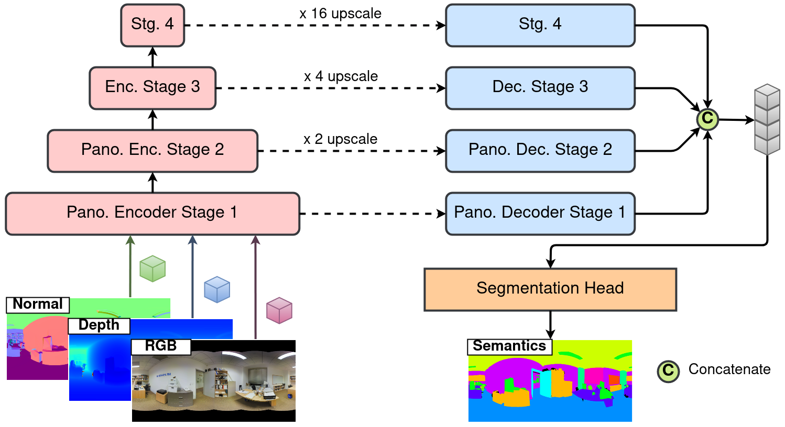

# SFSS-MMSI

Single Frame Semantic Segmentation Using Multi-Modal Spherical Images

## Description

The official implementation of **Single Frame Semantic Segmentation Using Multi-Modal Spherical Images, Accepted to WACV 2024**:
More details can be found in our paper [[**PDF**](https://arxiv.org/pdf/2308.09369.pdf)].


## Getting started

```python
<root>$ git clone git@github.com:sguttikon/SFSS-MMSI.git
<root>$ git clone -b sfss_mmsi git@github.com:sguttikon/matterport_utils.git
<root>$ git clone -b sfss_mmsi git@github.com:sguttikon/py360convert.git
```

## Installation

```python
(base) <root>$ conda create --name sfss_mmsi
(base) <root>$ conda activate sfss_mmsi
(sfss_mmsi) <root>$ conda install pytorch==1.13.1 torchvision==0.14.1 torchaudio==0.13.1 pytorch-cuda=11.7 -c pytorch -c nvidia
(sfss_mmsi) <root>$ conda install -c "nvidia/label/cuda-11.7.0" cuda-toolkit
(sfss_mmsi) <root>$ export CUDA_HOME=$CONDA_PREFIX
(sfss_mmsi) <root>$ python -m pip install timm==0.6.12 fvcore==0.1.5.post20221221 open3d==0.16.0 easydict==1.10 opencv-python==4.7.0.68 tensorboardx==2.5.1 notebook==7.0.2
(sfss_mmsi) <root>$ python -m pip install -U openmim==0.3.5
(sfss_mmsi) <root>$ mim install mmcv-full==1.6.2
(sfss_mmsi) <root>$ python -m pip install mmsegmentation==0.30.0
(sfss_mmsi) <root>$ python -m pip install -e py360convert
(sfss_mmsi) <root>$ cd SFSS-MMSI
(sfss_mmsi) <repo_path>$
```

## Usage

```
README.md
LICENSE
train.py
eval.py
/configs
    /mp
    /sct
    /sid
/data_processing
/dataloader
/datasets
    /2D-3D-Semantics-1K
    /Structured3D-1K
    /Matterport3D-1K
/engine
/models
/utils
/visualization
/pretrained
    /segformers
/workdirs
    /Stanford2D3DS_1024x512
    /Structured3D_1024x512
    /Matterport3D_1024x512
```

### Datapreparation

After installing the dependencies, we download and preprocess the datasets: [Stanford2D3DS](http://buildingparser.stanford.edu/dataset.html), [Structured3D](https://structured3d-dataset.org/) and [Matterport3D](https://niessner.github.io/Matterport/). Refer to `data_processing/`.

### Train

Refer [RGBX_Semantic_Segmentation](https://github.com/huaaaliu/RGBX_Semantic_Segmentation) for the pretrained segformer weights and place it under `pretrained/segformers`.

```python
(sfss_mmsi) <repo_path>$ python -m train --config configs.sid.unimodal --devices 1
(sfss_mmsi) <repo_path>$ python -m train --config configs.sid.bimodal --devices 1
(sfss_mmsi) <repo_path>$ python -m train --config configs.sid.trimodal --devices 1

(sfss_mmsi) <repo_path>$ python -m train --config configs.sct.unimodal --devices 1
(sfss_mmsi) <repo_path>$ python -m train --config configs.sct.bimodal --devices 1
(sfss_mmsi) <repo_path>$ python -m train --config configs.sct.trimodal --devices 1
```

### Eval

```python
(sfss_mmsi) <repo_path>$ python -m eval --config configs.sid.unimodal --split validation --epochs epoch-best.pth
(sfss_mmsi) <repo_path>$ python -m eval --config configs.sid.bimodal --split validation --epochs epoch-best.pth
(sfss_mmsi) <repo_path>$ python -m eval --config configs.sid.trimodal --split validation --epochs epoch-best.pth

(sfss_mmsi) <repo_path>$ python -m eval --config configs.sct.unimodal --split <validation/test> --epochs epoch-best.pth
(sfss_mmsi) <repo_path>$ python -m eval --config configs.sct.bimodal --split <validation/test> --epochs epoch-best.pth
(sfss_mmsi) <repo_path>$ python -m eval --config configs.sct.trimodal --split <validation/test> --epochs epoch-best.pth
```

## Result

### Stanford2D3DS dataset

| **Network**       | **Fold**  | **mAcc**    | **aAcc**    | **mIoU**    | Download        |
| :---------------: | :-------: | :---------: | :---------: | :---------: | :-------------: |
| Unimodal (RGB)    |    avg    |   63.955    |   80.417    |   52.873    | [download](https://cloud.dfki.de/owncloud/index.php/s/S6HqczbR3yL4Z82?path=%2Fworkdirs%2FStanford2D3DS_1024x512) |
| Bimodal  (RGB-D)  |    avg    |   66.021    |   84.889    |   55.492    | [download](https://cloud.dfki.de/owncloud/index.php/s/S6HqczbR3yL4Z82?path=%2Fworkdirs%2FStanford2D3DS_1024x512) |
| Bimodal  (RGB-N)  |    avg    |   68.787    |   86.686    |   58.239    | [download](https://cloud.dfki.de/owncloud/index.php/s/S6HqczbR3yL4Z82?path=%2Fworkdirs%2FStanford2D3DS_1024x512) |
| Bimodal  (RGB-H)  |    avg    | **70.683**  | **88.066**  | **60.603**  | [download](https://cloud.dfki.de/owncloud/index.php/s/S6HqczbR3yL4Z82?path=%2Fworkdirs%2FStanford2D3DS_1024x512) |
| Trimodal (RGB-D-N)|    avg    |   69.031    |   87.322    |   59.426    | [download](https://cloud.dfki.de/owncloud/index.php/s/S6HqczbR3yL4Z82?path=%2Fworkdirs%2FStanford2D3DS_1024x512) |

### Structured3D dataset

| **Network**       | **valid mAcc** | **valid aAcc** | **valid mIoU** | **test mAcc** | **test aAcc** | **test mIoU** | Download        |
| :---------------: |:-------------: | :------------: | :------------: |:------------: | :-----------: | :-----------: | :-------------: |
| Unimodal (RGB)    |     80.476     |     95.729     |     71.941     |    76.099     |    95.388     |    68.343     | [download](https://cloud.dfki.de/owncloud/index.php/s/S6HqczbR3yL4Z82?path=%2Fworkdirs%2FStructured3D_1024x512%2Flog_Structured3D_mit_b2_DMLPDecoderV2) |
| Bimodal  (RGB-D)  |     82.043     |     96.253     |     73.775     |    77.881     |    95.670     |    70.169     | [download](https://cloud.dfki.de/owncloud/index.php/s/S6HqczbR3yL4Z82?path=%2Fworkdirs%2FStructured3D_1024x512%2Flog_Structured3D_dual_mit_b2_DMLPDecoderV2_Depth) |
| Bimodal  (RGB-N)  |     83.247     |     96.500     |     74.378     |    78.683     |    96.115     |    71.001     | [download](https://cloud.dfki.de/owncloud/index.php/s/S6HqczbR3yL4Z82?path=%2Fworkdirs%2FStructured3D_1024x512%2Flog_Structured3D_dual_mit_b2_DMLPDecoderV2_Normal) |
| Trimodal (RGB-D-N)|   **84.466**   |   **96.851**   |   **75.863**   |  **79.671**   |  **96.340**   |  **71.971**   | [download](https://cloud.dfki.de/owncloud/index.php/s/S6HqczbR3yL4Z82?path=%2Fworkdirs%2FStructured3D_1024x512%2Flog_Structured3D_trio_mit_b2_DMLPDecoderV2_Depth_Normal) |

### Matterport3D dataset

| **Network**       | **valid mAcc** | **valid aAcc** | **valid mIoU** | **test mAcc** | **test aAcc** | **test mIoU** | Download        |
| :---------------: |:-------------: | :------------: | :------------: |:------------: | :-----------: | :-----------: | :-------------: |
| Unimodal (RGB)    |     46.739     |     76.694     |     35.154     |    43.655     |    69.169     |    31.301     |  |
| Bimodal  (RGB-D)  |     51.395     |     78.763     |     39.191     |    49.242     |  **71.592**   |  **35.921**   |  |
| Bimodal  (RGB-N)  |     51.136     |     78.738     |     38.912     |  **50.387**   |    71.239     |    35.773     |  |
| Trimodal (RGB-D-N)|   **51.563**   |   **78.937**   |   **39.263**   |    50.007     |    71.422     |    35.520     |  |

## Visuals


In [infer_pano_sem.ipynb](visualization/infer_pano_sem.ipynb), we use an out-of-training-distribution 360 image from PanoContext as an example.

Additionally, see [infer_s2d3d_sem.ipynb](visualization/infer_s2d3d_sem.ipynb), [infer_s2d3d_sem.ipynb](visualization/infer_s2d3d_sem.ipynb), and [infer_mp3d_sem.ipynb](visualization/infer_mp3d_sem.ipynb) for interactive demo and visualization.

## Contributing

If you are willing to contribute to this project, please contact with the authors.

## Authors and acknowledgment

Our code is heavily based on [Trans4PASS+](https://github.com/jamycheung/Trans4PASS) and [RGBX_Semantic_Segmentation](https://github.com/huaaaliu/RGBX_Semantic_Segmentation), thanks for their excellent work!

We also appreciate the open-source works:
* [SegFormer](https://github.com/NVlabs/SegFormer)
* [ShapeConv](https://github.com/hanchaoleng/ShapeConv)
* [matterport_utils](https://github.com/atlantis-ar/matterport_utils)
* [py360convert](https://github.com/sunset1995/py360convert)
* [Depth2HHA-python](https://github.com/charlesCXK/Depth2HHA-python)
* [mmsegmentation](https://mmsegmentation.readthedocs.io/en/0.x/)

**This work was partially funded by the EU Horizon Europe Framework Program under grant agreement 101058236 ([HumanTech](https://humantech-horizon.eu/)).**

## License

This repository is under the MIT license. For commercial use, please contact with the authors.

## Citations

If you find this repo useful, please consider referencing the following paper:

```
@article{DBLP:journals/corr/abs-2308-09369,
  author       = {Suresh Guttikonda and
                  Jason Rambach},
  title        = {Single Frame Semantic Segmentation Using Multi-Modal Spherical Images},
  journal      = {CoRR},
  volume       = {abs/2308.09369},
  year         = {2023}
}
```

## Project status

We are working on releasing the code and trained models, but no guarantee when the code will be released.
